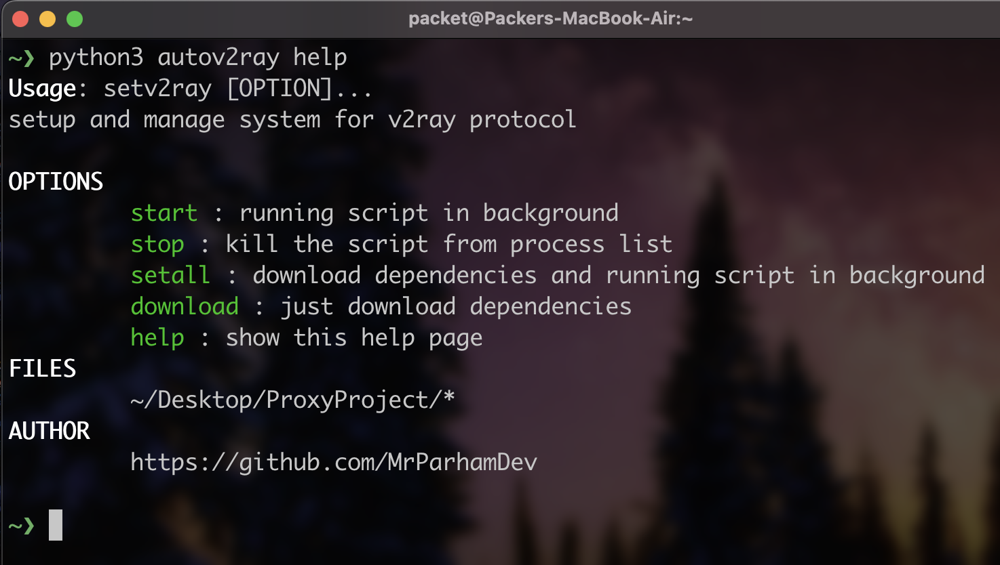

<h1 align="center"> ‍AutoV2ray CLI Client <br>
 
 


# Description
This is a Script to install Dependencys and Setup v2ray Configs on Your System <br>
This script has several default configurations, the speed and operation status of which is the responsibility of the script.
You can also use the subscription link of your choice.
 
<br>
 
 Bug Reports => https://t.me/forfreedominternetgp
 
 # Requirements and packages that will be installed
| macOS        | GNU / Linux |
| -----------  | ----------  |
| Home Brew    | wget        |   
| wget         | unzip       |
| unzip        | v2ray core  |
| v2ray core   |             |

 
 
# Supported Architectures
| macOS       | GNU / Linux |
| ----------- | ----------|
| arm         |  amd64    |   
| amd64       |           |

<br>
 
 
# Donation <br>
> `Dogecoin D9Urw7aVyzgpwiDJ5kcPaqsPi8Yyq2PFL7` <br>
> `Tether (ERC20) 0x189eF43f2F44d9C147b72d33aaf9881aC3BC58c6` <br>
> `Solana 7UxTMhRhSmnim6SRZbJWQcfhr3ceYYy3UWKMp6ctL2mn` <br>
> `Ethereum ‍‍‍‍‍‍0x189eF43f2F44d9C147b72d33aaf9881aC3BC58c6` <br>

<br> 
 
# Script Hints:
> `Please run Script Without using Root User` <br>
> `Please run the Script only with Python and avoid Running it Using Addresses`<br>
> `Please Connected to the Internet when Using the Script`

<br>

# Cloning the Project
```bash
git clone https://github.com/MrParhamDev/AutoV2ray
```

# Usage
If the Script Works Correctly, After Executing the Command Below, You should Receive such an output

 ```bash
 python3 autoV2ray.py help
 ```
 ## or
If you want having an easier life run ```script.sh``` then you can run autoV2ray.py like this
```bash
 autoV2ray help
 ```
 
 
 
 If You Are running the script for the first time, use the `setall` argument<br>
 Use the `download` argument to Download Dependencies Alone<br>
 To run the Script Useing `start` argument (The `setall` argument must be executed the first time after project execution)<br>
 to stop the Script Using the `stop` argument and for showing help using `help` argument<br>
